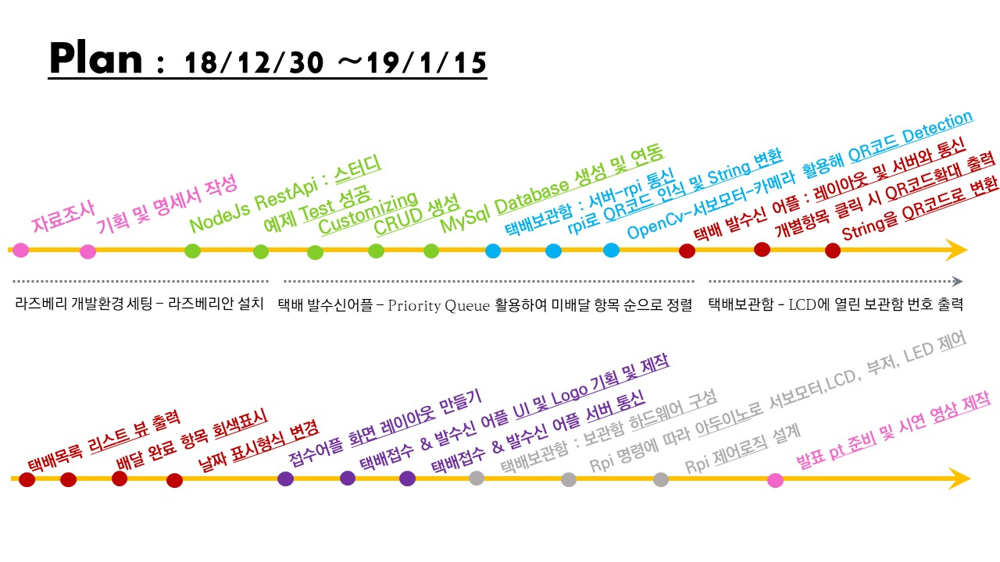
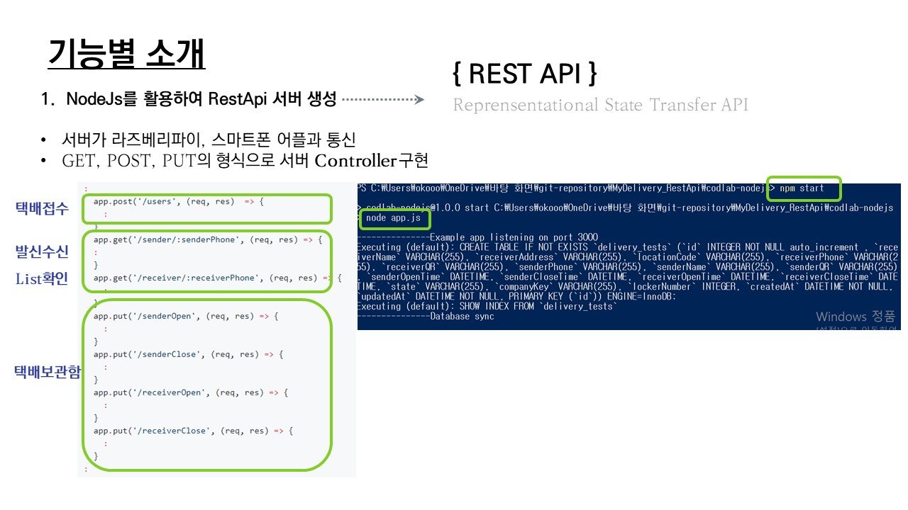

# MyDelivery(IoT Project)
- 이 프로젝트는 무인택배함을 수신자 및 배달기사가 **QR코드**로 인식하여 열고 닫으며, 택배를 배달 및 수신 합니다. 이를 통해 보안을 강화하는 프로젝트입니다.
- 19년 12월 ~ 19년 1월 15일

##  이 프로젝트의 **Tech Stack**

<p align="center">
	
</p>

```dart
java, javascript, python, MySql, Sequelize, Node.js, Android Studio, Mocha Test, Supertest, express, body-parser, curl, date-utils
```

## 문제제기 & 기획 주제

### Problems

<p align="center">
	
	
</p>

### Our Solution

<p align="center">
  
  
  	
</p>

## 기획과정(plan)

<p align="center">
	
</p>

## 전체 구조

<p align="center">
	
</p>

## **Sensor**

```dart
- Raspberry Pi
- Arduino
- Pi Cam
- Reed Switch
- Servo Motor
```

## 기능별 소개

### 1. NodeJs를 활용하여 RestApi 서버 생성
* 서버가 라즈베리파이, 스마트폰 어플과 통신
* GET, POST, PUT, DELETE의 형식으로 **Controller** 구현

자세한 내용은 [app.js](./codlab-nodejs/app.js)에 있습니다.

<p align="center">
	
</p>

```javascript
:
  app.post('/users', (req, res)  => {
    :
  }
  app.get('/sender/:senderPhone', (req, res) => {
  :
  }
  app.get('/receiver/:receiverPhone', (req, res) => {
    :
  }
  app.put('/senderOpen', (req, res) => {
    :
  }
  app.put('/senderClose', (req, res) => {
    :
  }
  app.put('/receiverOpen', (req, res) => {
    :
  }
  app.put('/receiverClose', (req, res) => {
    :
  }
:
```
* Model 분리

<p align="center">
	
</p>

자세한 내용은 [models.js](./codlab-nodejs/models.js)에 있습니다.
```javascript
const User = sequelize.define('delivery_test', {
    receiverName: Sequelize.STRING,  //  name값이 문자열임을 정의 (id는 기본으로 만들어줌)
    receiverAddress : Sequelize.STRING,
    locationCode : Sequelize.STRING,
    receiverPhone : Sequelize.STRING,
    receiverQR : Sequelize.STRING,
    senderPhone : Sequelize.STRING,
    senderName : Sequelize.STRING,
    senderQR : Sequelize.STRING,
    senderOpenTime : Sequelize.DATE,
    senderCloseTime : Sequelize.DATE,
    receiverOpenTime : Sequelize.DATE,
    receiverCloseTime : Sequelize.DATE,
    state : Sequelize.STRING,
    companyKey : Sequelize.STRING,
    lockerNumber : Sequelize.INTEGER
  });
```
* **랜덤**으로 QR코드 String으로 생성 후, 발신 및 수신 어플에서 QR코드 구현

<p align="center">
	
</p>

```javascript
:
//   1. 접수직원 / create : post
app.post('/users', (req, res)  => {

//  랜덤 QR코드 String 생성
  var randomQR = '0';// senderQR코드는 0으로시작
  
for (var i = 0; i < 20; i++){
    var rIndex = Math.floor(Math.random() * 3);
    switch (rIndex) {
    case 0:
        // a-z
        randomQR+=String( ( (Math.floor(Math.random() * 26))+ 97) );
        break;
    case 1:
        // A-Z
        randomQR+= String( ( (Math.floor(Math.random() * 26)) + 65) );
        break;
    case 2:
        // 0-9
        randomQR+=(Math.floor(Math.random() * 10));
        break;
    };
};
:
```

### 2. 발신자 어플, 수신자어플
* 접수어플 (발신자 어플)
* 발신자의 번호를 발신자 어플에서 자동 인식
* 발신자의 배달 목록을 **ListView** 를 활용하여 아래의 **우선순위로 정렬**
  1. 배달 현황(registration, locked, received)
  2. 접수시간(mysql의 creatAt 데이터 활용)
  
<p align="center">
  	
</p>

* 수신완료 항목은 black, 배달완료 항목은 gray background 처리하여 구분

```java
:
//  배달이 완료되면 배경색 회색 변경
        if(list.get(pos).getState().equals("0")){   // reg
            s_layout.setBackgroundColor(Color.rgb(255,255,255));
        }else if(list.get(pos).getState().equals("1")){//   locked
            s_layout.setBackgroundColor(Color.rgb(150,150,150));
        }else if(list.get(pos).getState().equals("2")){ //  received
            s_layout.setBackgroundColor(Color.rgb(100,100,100));
        }
:
```
* 각 항목 클릭 시, **확대된 QR코드**와 **Sender Open/Close Time, Receiver Open/Close Time** 출력

<p align="center">
  	
</p>

```javascript
:
// 이미지 클릭 시 동작
        iv_thumb.setOnClickListener(new View.OnClickListener() {
            @Override
            public void onClick(View view) {
                //  QR코드 확대해서 보여주기
                Intent intent  = new Intent(context,QrcodeInfoActivity.class);
                intent.putExtra("SenderOpenTime", list.get(pos).getSenderOpenTime());
                intent.putExtra("SenderCloseTime", list.get(pos).getSenderCloseTime());
                intent.putExtra("ReceiverOpenTime", list.get(pos).getReceiverOpenTime());
                intent.putExtra("ReceiverCloseTime", list.get(pos).getReceiverCloseTime());

                String QR_string = list.get(pos).getSender_qr();
                Bitmap bitmap;

                if(list.get(pos).getState().equals("0")) { // 상태가 registered인 경우는 qr코드 생성해서 넣어주기
                    bitmap = string_to_QRcode(QR_string);
                    ByteArrayOutputStream stream = new ByteArrayOutputStream();
                    bitmap.compress(Bitmap.CompressFormat.PNG, 100, stream);
                    byte[] bytes = stream.toByteArray();
                    intent.putExtra("QRcode",bytes);
                    intent.putExtra("whichImage", "bitmap");
                }else if(list.get(pos).getState().equals("1")){
                    intent.putExtra("whichImage", "1");
                }
                else if(list.get(pos).getState().equals("2")){
                    intent.putExtra("whichImage", "2");
                }
                context.startActivity(intent);
            }
        });
        return view;
    }
:
```
* 서버에서 받은 랜덤 String으로 **QR코드 구현**

자세한 내용은 [models.js](./MyDelivery/app/src/main/java/com/example/test/mydelivery/Adapter/SenderListViewAdapter.java)에 있습니다.
```java
:
Bitmap string_to_QRcode(String string_QR){
        Bitmap bitmap_QR;
        WindowManager manager = (WindowManager) context.getSystemService(WINDOW_SERVICE);
        Display display = manager.getDefaultDisplay();
        Point point = new Point();
        display.getSize(point);
        int width = point.x;
        int height = point.y;
        int smallerDimension = width < height ? width : height;
        smallerDimension = smallerDimension * 3 / 4;
        qrgEncoder = new QRGEncoder(
                string_QR, null,
                QRGContents.Type.TEXT,
                smallerDimension);
        try {
            bitmap_QR = qrgEncoder.encodeAsBitmap();

            return bitmap_QR;
        } catch (WriterException e) {
            Log.v(TAG, e.toString());
        }
        return null;
    }
:
```

### 4. 배달 접수 어플
* 아래의 항목을 입력하면 서버로 data 전송

<p align="center">
  	
</p>

### 5. 하드웨어 제어 로직
* 보관함 크기(small / big)에 따라 화면 분할(left / right)하여 QR코드 인식
자세한 내용은[](./)에 있습니다.

<p align="center">
  	
  	
</p>

* Arduino
자세한 내용은[](./)에 있습니다.
```java
void loop() {
  if (state == 0){// 문이 닫혀있는 상태 -> 라즈베리파이로부터 문을 열어달라는 신호를 기다림
    char ch = Serial.read();
    if(ch == 'o'){ // o는 open을 의미함
      // 서보모터로 문을 열어줌
      myservo.write(servoOpen);
      led_red();
      // state를 1(open)로 변경
      state = 1;
    }
  }
  else if (state == 1){ // 문이 열려있는 상태 -> 리드센서를 확인하여 문이 닫히는 순간을 라즈베리파이에게 알려줌
    // 리드스위치 읽기
    int reed_switch = digitalRead(reedPin);
    if(reed_switch == 0){//문이 닫히는 경우
      reedCount++;
      led_yello();
      delay(100);
    }
    else {
      reedCount = 0;
      led_red();
    }

    if(reedCount > 10){ // reed센서가 자격을 특정횟수 이상만큼 연속으로 감지하면 문 잠금
      myservo.write(servoClosed); // 문 닫기 
      Serial.println('c'); // c는 closed를 의미, 라즈베리파이에 문이 닫힘을 알려줌
      reedCount = 0;
      state = 0; // 상태를 closed로 바꿈
      led_white();
    }
  }
```
